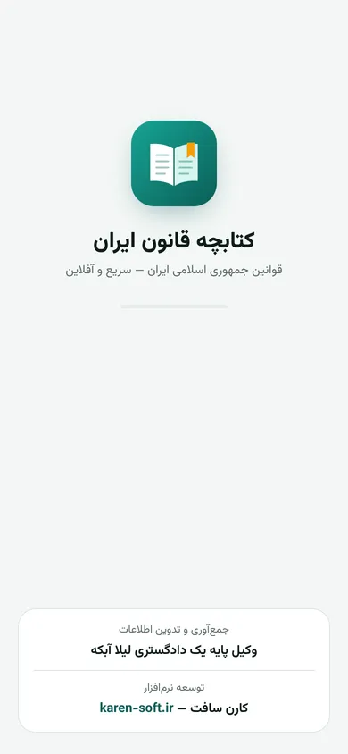
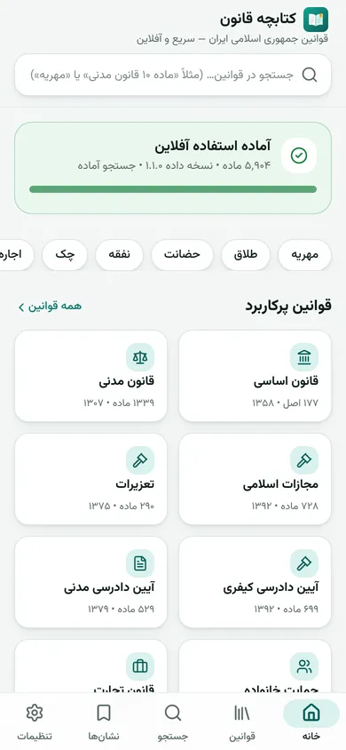
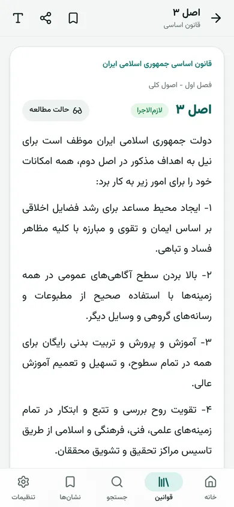
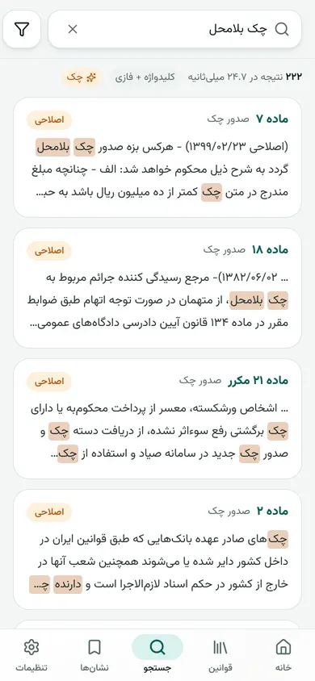
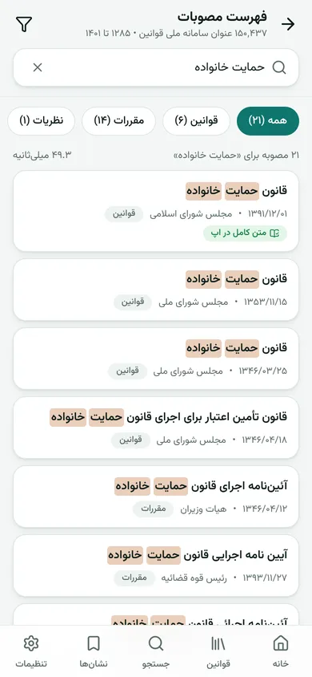
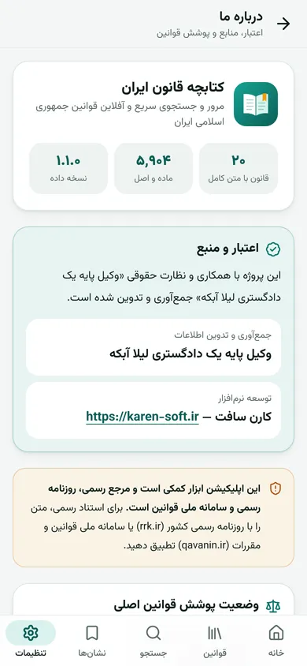
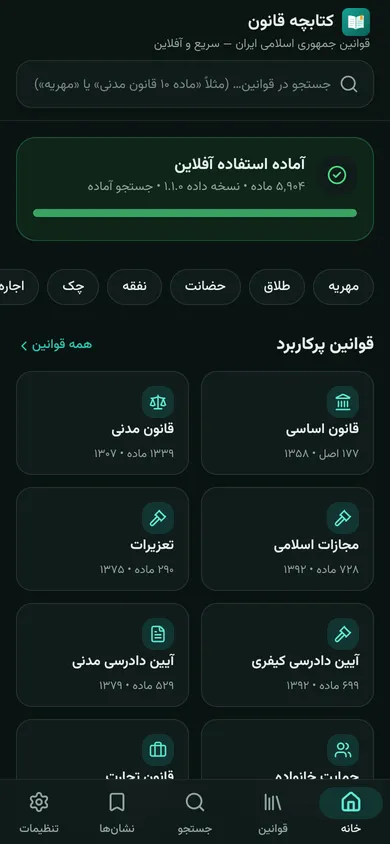

<div dir="rtl">

# کتابچه قانون ایران 📘

اپلیکیشن وب پیش‌رونده (PWA) برای **مرور، جستجو و مطالعه آفلاین قوانین جمهوری اسلامی ایران** — قابل نصب روی صفحه اصلی گوشی، با تجربه‌ای شبیه اپ‌های بومی.

> **این اپلیکیشن ابزار کمکی است و مرجع رسمی، روزنامه رسمی و سامانه ملی قوانین است**

## اعتبار و منبع

این پروژه با همکاری و نظارت حقوقی «وکیل پایه یک دادگستری لیلا آبکه» جمع‌آوری و تدوین شده است.

- **جمع‌آوری و تدوین اطلاعات:** وکیل پایه یک دادگستری لیلا آبکه
- **توسعه نرم‌افزار:** کارن سافت — [karen-soft.ir](https://karen-soft.ir)

این دو مرجع در صفحه اسپلش (هنگام اجرای اپ)، فوتر همه صفحات و صفحه «درباره ما» نمایش داده می‌شوند (منبع واحد: [`src/lib/credits.ts`](src/lib/credits.ts)).

<p align="center">
  
  
  
  
</p>
<p align="center">
  
  
  
  
</p>

## آنچه در این نسخه هست

| | |
|---|---|
| **داده‌ها** | ۲۰ قانون اصلی با **متن کامل و تلفیقی (با اصلاحات)** — ۵٬۹۰۴ ماده/اصل؛ ۳۷ مورد دیگر کاتالوگ (همه زیرموضوع‌های الزامی مشخصات)، ۳۰ مورد با **پیوند مستقیم متن رسمی** در سامانه ملی قوانین و مجموعه‌ها (آرا، نظریات، مقررات) با پیوند به فهرست مصوبات ([وضعیت پوشش](docs/COVERAGE.md)) |
| **فهرست همه مصوبات** | عنوان، تاریخ و مرجع تصویب **۱۵۰٬۴۳۷ مصوبه** سامانه ملی قوانین از ۱۲۸۵ تا ۱۴۰۱/۰۱/۳۰ (قوانین، مقررات دولتی، آرای وحدت رویه و دیوان عدالت اداری، نظریات مشورتی، مصوبات شوراها) — جستجوی آنی در Web Worker (۱۰ تا ۵۰ میلی‌ثانیه)، فیلتر نوع/مرجع/سال، پیوند متن رسمی و دریافت برای استفاده آفلاین (~۴٫۶MB gzip) |
| **نصب** | بنر A2HS + پنجره نصب [`@khmyznikov/pwa-install`](https://github.com/khmyznikov/pwa-install) (راهنمای بومی iOS/Android/مرورگرهای درون‌برنامه‌ای، فارسی و RTL؛ بارگذاری تنبل) و تصاویر manifest برای پنجره نصب غنی |
| **آفلاین** | پس از اولین بار (~۶۸۰KB با Brotli)، همه قوانین، جستجو، نشان‌ها و یادداشت‌ها بدون اینترنت کار می‌کنند |
| **کارایی** | Lighthouse موبایل (شبکه کند و CPU ×۴ شبیه‌سازی‌شده) برای صفحه اصلی: **۱۰۰ در Performance، Accessibility، Best Practices و SEO**؛ بار اول ~۲۰۵KB gzip (HTML با CSS درون‌خطی + JS)؛ اسپلش و اسکلت صفحه فقط با HTML و پیش از اجرای JS نمایش داده می‌شوند ([جزئیات: بخش «کارایی» در ARCHITECTURE](docs/ARCHITECTURE.md)) |
| **جستجو** | پنج لایه: شماره ماده («ماده ۱۰ قانون مدنی»، «م ۱۰ ق.م»، «اصل ۴۴»)، کلیدواژه (BM25)، عبارت دقیق («…»)، فازی (تحمل غلط تایپی) و مفهومی (هم‌معناها) — در Web Worker؛ معمولاً **زیر ۲۰ میلی‌ثانیه** |
| **نرمال‌سازی** | ي/ك ← ی/ک، اعراب، کشیده، نیم‌فاصله، ارقام فارسی/عربی ← لاتین، همزه‌ها |
| **رابط کاربری** | RTL کامل، قلم وزیرمتن (خودمیزبان)، ناوبری پایین ۵ زبانه، Bottom Sheet، کارت‌های قابل کشیدن (راست: نشان، چپ: اشتراک)، Pull-to-Refresh، اسکلتون، حالت تیره خودکار/دستی، حالت مطالعه (قلم/اندازه/فاصله خطوط/سپیا) |
| **امکانات** | نشان‌گذاری، یادداشت شخصی، تاریخچه جستجو، اشتراک متن ماده، کپی سریع، QR، محاسبه‌گر ارث و دیه (با استناد به مواد قانون)، اعلان تغییر مواد نشان‌شده، پشتیبان‌گیری JSON |
| **حریم خصوصی** | Local-first؛ هیچ حساب کاربری، کوکی یا ابزار ردیابی |
| **به‌روزرسانی** | نسخه‌بندی معنایی (semver) و ارسال فقط تغییرات با **JSON Patch** (RFC 6902)؛ Background Sync و Periodic Sync |

### دقت حقوقی

- هیچ متنی تولید، خلاصه یا بازنویسی نشده است. متن‌ها «متن تلفیقی» **سامانه ملی قوانین و مقررات (qavanin.ir)** هستند که از یک برداشت متن‌باز (MIT) بایگانی‌شده در تاریخ **۱۴۰۳/۰۲/۱۵** گرفته شده‌اند ([منشأ کامل](data/SOURCES.md)).
- تاریخ آخرین به‌روزرسانی متن کنار هر قانون و هر ماده نمایش داده می‌شود؛ اصلاحات پس از آن تاریخ باید با ابزار برداشت وارد شوند.
- کنترل کیفیت خودکار ([`data/qa-report.md`](data/qa-report.md)): پیوستگی شماره مواد، تکرار، مواد بدون متن؛ تعداد مواد با مراجع تطبیق دارد (قانون اساسی ۱۷۷ اصل، قانون مدنی ۱۳۳۵ ماده، آیین دادرسی مدنی ۵۲۹ ماده و ۷۲ تبصره، قانون کار ۲۰۳ ماده).
- مواد منسوخ و اصلاحی با برچسب، و نشانگرهای «(اصلاحی …)» و «[… الحاق شده است]» عیناً و متمایز نمایش داده می‌شوند.

## شروع سریع

پیش‌نیاز: Node.js 20+ (و Python 3.11 فقط برای بازسازی داده‌ها)

```bash
npm install
npm run dev        # http://localhost:5173  (پیش از اجرا داده‌ها بسته‌بندی می‌شوند)
npm run build      # خروجی در dist/
npm run preview    # پیش‌نمایش نسخه تولیدی (Service Worker فعال) روی :4173
npm test           # تست‌های TypeScript (نرمال‌سازی، پرس‌وجو، ارث، دیه، JSON Patch، فهرست مصوبات، اعتبار)
npm run test:py    # تست‌های پایتون (نرمال‌سازی، تجزیه‌گر متن قوانین، ورود فهرست عناوین)
npm run size       # گزارش حجم بار اول و داده‌ها (gzip/brotli)
```

## معماری در یک نگاه

```
data/raw/qavanin-index/qavanin-list.tsv.gz ──(Node)──▶ public/data/qindex/* (۱۵۰ هزار عنوان، ۵۷ بسته) ──▶ Web Worker فهرست مصوبات
data/raw/qavanin-text/*.txt ──(Python: normalize + parse + QA)──▶ data/laws/*.json  (متعارف، در Git)
                                                                        │
                                       (Node: scripts/bundle-data.ts)  ▼
public/data/manifest.json + catalog + chunks/*.json (≤۵۰۰KB) + patches/*.json (JSON Patch)
                                                                        │  fetch (SW: SWR / Network-First)
                                                                        ▼
            IndexedDB «GhanounDB» (Dexie) ◀──── Web Worker جستجو (MiniSearch، ایندکس کش‌شده)
                         ▲
              React + Vite + Tailwind + framer-motion (RTL، code-splitting، virtual scroll)
```

جزئیات: [ARCHITECTURE.md](docs/ARCHITECTURE.md) · [DATA_PIPELINE.md](docs/DATA_PIPELINE.md) · [DEPLOYMENT.md](docs/DEPLOYMENT.md) · [UPDATING.md](docs/UPDATING.md) · [COVERAGE.md](docs/COVERAGE.md)

## ساختار پروژه

```
src/
  pages/            صفحات (خانه، قوانین، قانون، ماده، جستجو، فهرست مصوبات، نشان‌ها، تنظیمات، ابزارها، درباره ما)
  components/       اجزای رابط (AppBar، BottomNav، Sheet، ArticleCard، TocTree، …)
  lib/              db (Dexie)، data/sync (نصب و JSON Patch)، search (موتور و تحلیل پرس‌وجو)، qindex (فهرست مصوبات)،
                    credits (اعتبار پروژه)، splash، pwa-install، normalize، inheritance، diyeh، settings، share، …
  workers/          search.worker.ts، qindex.worker.ts (فهرست مصوبات)
  sw.ts             Service Worker (Workbox: precache، SWR، Background/Periodic Sync، Push)
scripts/
  pipeline/         normalize_fa.py، parse_qavanin.py، build_laws.py، export_sqlite.py، gen_docs.py + tests
  scraper/          qavanin_playwright.py (Playwright)، fetch_http.py (BeautifulSoup)، polite.py (robots.txt/نرخ)
  admin/            rrk_watch.py (پایش هفتگی روزنامه رسمی)، push-notify.mjs (Web Push)
  semantic/         build_embeddings.py (اختیاری: بردارهای معنایی برای sqlite-vec/pgvector)
  bundle-data.ts    بسته‌بندی داده و ساخت patch نسخه‌ها
data/
  catalog.json      فهرست قوانین (۵۷ مورد با شناسه سامانه ملی قوانین)، سلسله‌مراتب ۷ سطحی، ۱۰ دسته موضوعی و زیرموضوع‌ها
  glossary.json     واژه‌نامه مفاهیم حقوقی (کلیدواژه و جستجوی مفهومی)
  raw/              qavanin-text/ متن‌های خام + مجوز منبع؛ qavanin-index/ فهرست عناوین همه مصوبات + SOURCE.md
  laws/             داده متعارف     releases/ patches/  نسخه‌ها (۱.۰.۰ → ۱.۱.۰)
```

## خروجی‌های داده

- **JSON** متعارف هر قانون: `data/laws/<id>.json` (فهرست مطالب درختی، مواد، تبصره‌ها، اصلاحات، وضعیت، ارجاعات، کلیدواژه‌ها)
- **SQLite + FTS5**: `npm run data:sqlite` ← `data/build/lawbook.sqlite`
- **بسته‌های PWA**: `public/data/` (در زمان build ساخته می‌شود)

## مجوز و منابع

- متن قوانین، اسناد عمومی است. نسخه بایگانی‌شده از مخزن [HamedJahantigh-git/legal_chatbot](https://github.com/HamedJahantigh-git/legal_chatbot) (MIT) گرفته شده است — متن مجوز: `data/raw/qavanin-text/LICENSE.upstream.txt`.
- فهرست عناوین مصوبات: سامانه ملی قوانین، برداشت‌شده با خزنده متن‌باز abdal در مخزن [fatemeq/standard](https://github.com/fatemeq/standard) — جزئیات: [`data/raw/qavanin-index/SOURCE.md`](data/raw/qavanin-index/SOURCE.md).
- [`@khmyznikov/pwa-install`](https://github.com/khmyznikov/pwa-install) (MIT) و [Lit](https://lit.dev) (BSD-3-Clause).
- قلم‌ها: Vazirmatn و Noto Naskh Arabic (SIL OFL 1.1).

</div>

---

### English summary

**Ketabche Ghanoon** is an installable, offline-first React + Vite + TypeScript PWA for browsing and searching Iranian law. Legal content compiled under the supervision of attorney Leila Abkeh; software by [Karen Soft](https://karen-soft.ir) (credited on the splash screen, the footer of every page and the About page). Data version 1.1 ships 20 core laws (5,904 articles) as verbatim consolidated texts from the National Laws Portal (qavanin.ir), sourced through an MIT-licensed archive snapshot dated 2024-05-04, official qavanin.ir links for 49 catalog entries, and a searchable title index of 150,437 enactments (1285–1401 SH) with links to the official texts. It features a five-layer search engine (MiniSearch in a Web Worker): article number, keyword, phrase, fuzzy, and glossary-based concept matching. Data is stored in IndexedDB via Dexie. Updates use semver and ship as JSON Patch deltas. The Python pipeline handles scraping (Playwright, robots.txt-aware), normalization, parsing, QA, and SQLite/FTS5 export. See `docs/` for architecture, deployment, update workflow, and coverage.
